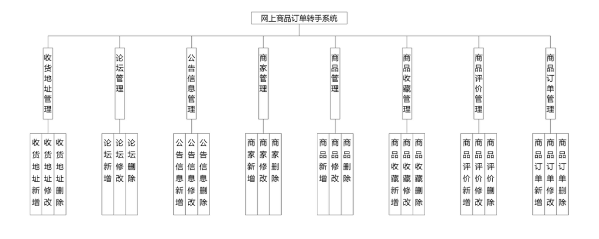
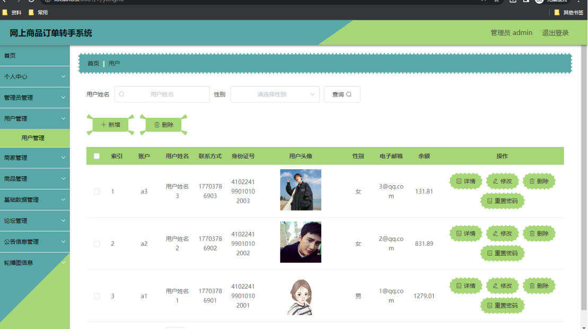
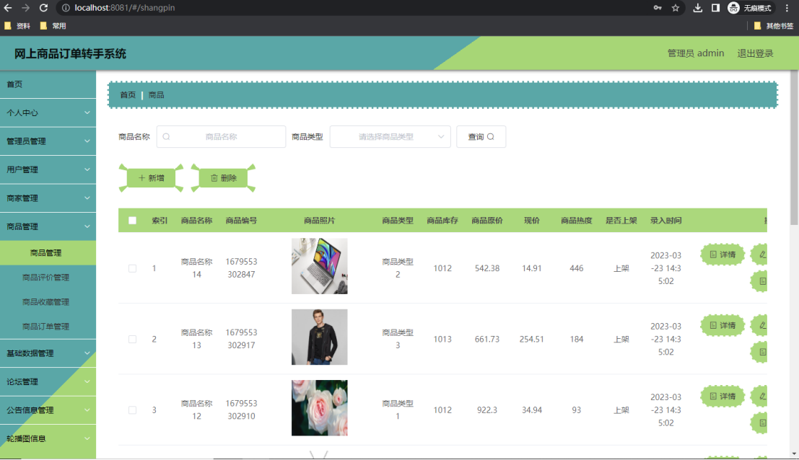
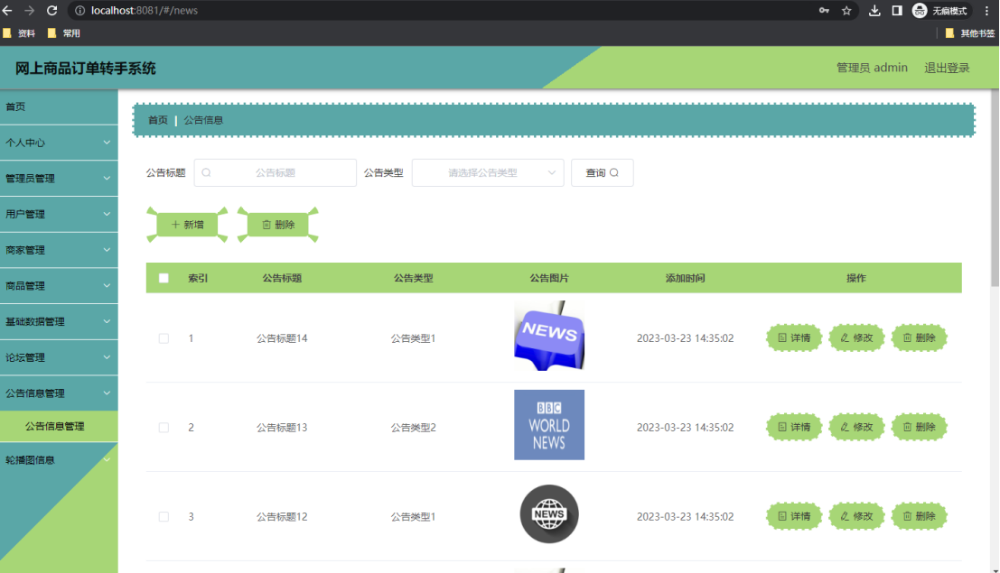
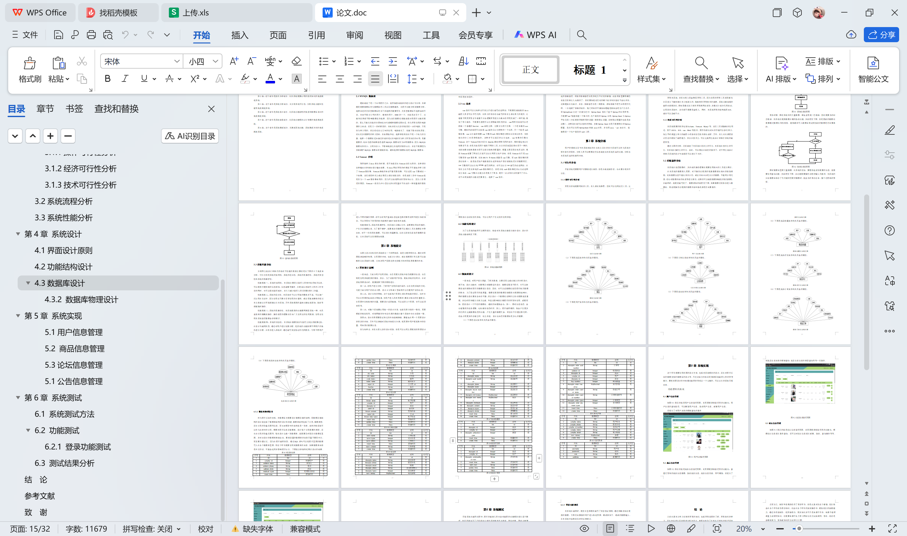

# springboot268-基于SpringBoot的网上商品订单转手系统

>  博主介绍：
>  Hey，我是程序员Chaers，一个专注于计算机领域的程序员
>  十年大厂程序员全栈开发‍ 日常分享项目经验 解决技术难题与技术推荐 承接各类网站设计，小程序开发，毕设等。
>  【计算机专业课程设计，毕业设计项目，Java，微信小程序，安卓APP都可以做，不仅仅是计算机专业，其它专业都可以】

## 本项目获取地址：https://www.bishecode.com/product/264/

## 3000套系统可挑选，获取链接：https://www.bishecode.com/

### 系统架构

> 前端：html | js | css | jquery | vue
>
> 后端：springboot | mybatis
> 
> 环境：jdk1.8+ | mysql | maven

# 一、内容包括
包括有  项目源码+项目论文+数据库源码+答辩ppt+远程调试成功

# 二、运行环境

> jdk版本：1.8 及以上； ide工具：IDEA； 数据库: mysql5.7及以上；编程语言: Java

# 三、需求分析

**3.1可行性分析**

尽管系统是根据用户的要求进行制作，但是在确定制作前，有必要分析其可行性。

**3.1.1操作可行性分析**

开发本系统需要用到的工具，本人都比较熟悉，因此可以使用这些工具，完整开发网上商品订单转手系统。此外，网上商品订单转手系统在功能上，基本都是完成信息的处理，涵盖了添加，修改，删除等，而且操作者面对的都是各个功能操作界面，并不是编码后台，所以一般的使用者都可以通过操作界面轻松完成信息的加工处理。因此，本系统操作可行。

**3.1.2经济可行性分析**

开发本系统，并没有投入资金购买开发工具。因为使用的开发工具都是事先在百度上下载安装在本人电脑上的，随着软件开发技术的成熟，系统功能实现的编码也都模块化，很容易通过各大软件开发类网站获取，并通过小部分代码改动，运用到本系统中，这些都不需要资金投入，同时，本系统开发的结构选用B/S，成本可以忽略不计。

**3.1.3技术可行性分析**

本系统需要的软件包括Eclipse，Tomcat，Mysql等，这些工具都接触并使用过，至于JAVA，B/S，vue，Html等技术，图书馆都有对应的书籍可以参考学习，加上平时课堂上学习的编程小项目对这些技术都有讲解，另外，本人也从课程设计作业中锻炼了编程能力。所以在技术上，可以完成网上商品订单转手系统的编程开发。
通过上面的分析，已经确定了本系统在经济上的可行，本系统在技术上的可行，本系统在操作上的可行。由此，可以得出在目前的条件下，对于网上商品订单转手系统的设计与实现是可以进行下去的。

**3.2系统流程分析**

本系统在处理数据时，其内部的操作逻辑也需要使用相应的工具进行展示。
在本系统的数据录入页面，对于操作者提供的每条数据都有相应的检验规则，比如数据信息不能有非法字符，或者本来应该是汉字的数据，不能用字母代替，还有对数据内容的长度等进行规范，这样的可以确保数据准确性的检验规则，在编码时，就提前编写好了。数据添加的流程见下图。如果数据已经保存进入数据库，则说明操作者提供的数据内容和格式都是符合要求的。

# 四、功能模块

为了让系统的编码可以顺利进行，特意对本系统功能进行细分设计，设计的系统功能结构见下图。

# 五、效果图展示【部分效果图】

图5.1 用户信息管理页面【如图5.1显示的就是用户信息管理页面，此页面提供给管理员的功能有：用户信息的查询管理，可以删除用户信息、修改用户信息、新增用户信息】

图5.2 商品信息管理页面【如图5.2显示的就是商品信息管理页面，此页面提供给管理员的功能有：查看已发布的商品信息数据，修改商品信息，商品信息作废，即可删除，还进行了对商品信息名称的模糊查询 商品信息信息的类型查询等等一些条件。】

图5.3 论坛信息管理页面【如图5.3显示的就是论坛信息管理页面，此页面提供给管理员的功能有：根据论坛信息进行条件查询，还可以对论坛信息进行新增、修改、查询操作等等。】

图5.4 公告信息管理页面【如图5.4显示的就是公告信息管理页面，此页面提供给管理员的功能有：根据公告信息进行新增、修改、查询操作等等。】

 <b>完整文章</b>
 

 

 
## 本项目获取地址：https://www.bishecode.com/product/264/

## 3000套系统可挑选，获取链接：https://www.bishecode.com/

